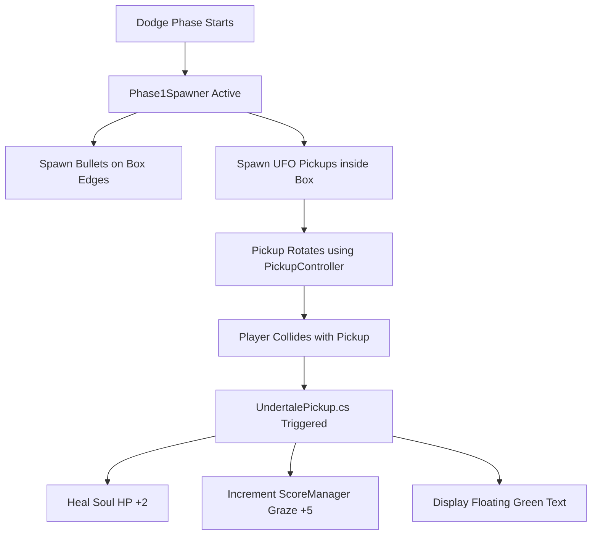

# Undertale Battle System - Technical Documentation

This document provides a professional, academic-style breakdown of the **Undertale Battle System** implemented in Unity. It outlines how the project incorporates fundamental Unity mechanics (specifically, the **UFO Game Pickups**) and expands upon them to create a polished, industry-standard turn-based battle experience.

---

## 1. Executive Summary

This project merges the core concepts of **Unity 101 (2D movement, triggers, and pickups)** with a tribute to the classic indie RPG *Undertale*. 
* **The Player (Red Soul)** navigates a turn-based menu to choose actions (FIGHT, ACT, ITEM, MERCY).
* **The Dodge Phase** morphs the battle arena into a square playground, where the player must dodge projectiles (bullets) and collect rotating golden **Pickups** (derived from the classroom UFO game).
* **Technical Highlights**: Clean script separation, object pooling, procedural scene rebuilding, fixed-anchor UI morphing, and direct integration with classroom-standard scripts (`ScoreManager.cs`, `PickupController.cs`).

---

## 2. UFO Pickup Integration & Hard Mode

To align with classroom teachings while showing advanced capabilities, the **UFO Pickup** mechanic has been integrated directly into the Undertale combat phase:

### Advanced Elements & Gameplay Balancing:
1. **Hard Mode**: To increase the challenge, the bullet hell phase spawns projectiles at a rate of one every **`0.45` seconds** (down from `0.8s`) with a faster travel velocity of **`3.5f` units** (up from `2.0f`).
2. **Dual Pickups**: The spawner randomly chooses between two types of UFO pickups:
   * **Green Pickup (Healing)**: Instantly heals the player for **+5 HP** (displays green `+5 HP` text).
   * **Yellow/Gold Pickup (Shield & Score)**: Grants the player **+15 Score/Graze** and provides a **2-second invulnerability shield** (during which the red soul flashes golden-yellow, protecting the player from all bullet damage).
3. **Magnet/Rotate**: Items use the original `PickupController` to spin smoothly in 2D space.

---

## 3. Audio-Visual Graze Feedback

A core mechanic of bullet-hell design is **Graze** (being dangerously close to bullets without colliding). The system rewards high-risk play by:
1. **Detection**: Whenever a bullet enters the player's outer circle radius (`grazeRadius = 0.6f`) but does not touch the inner hurt hitbox (`hitRadius = 0.15f`), a graze is registered.
2. **Audio Feedback**: Plays a rapid, satisfying retro blip sound effect (`PlayTextBlip()`).
3. **Visual Feedback**: Spawns a small, transient, semi-transparent white `+1` text indicator directly above the player's red heart, which floats upward and fades away.
4. **Scoring**: Adds **+1 Point** to the shared `ScoreManager`.

---

## 4. Simplified Turn Menu (Spare & Flee)

The turn actions under the **MERCY** menu have been streamlined to showcase standard branch logic:
* **SPARE**: Immediately spares Mr. Oshino, fading him out and triggering a victory condition.
* **FLEE**: Fails to escape (printing `* Escaping... but you couldn't escape! Mr. Oshino blocks your path.`), which immediately returns to the enemy turn and triggers the bullet hell phase, giving the teacher a fast loop to test the dodge gameplay!

---

## 5. Key Solutions to Complex Problems

During development, we resolved several advanced rendering and design challenges using simple, robust solutions:

1. **Rendering Overlaps (Z-Fighting)**: Unity URP draws ScreenSpace UI Canvas elements after 2D Sprites. By setting the Canvas `planeDistance = 15f` (placing the Canvas at Z = 5) and the Main Camera at Z = -10, we keep the UI Canvas physically behind world-space sprites (Z = 0) to ensure the Player Soul is always visible.
2. **Transparent Button Envelopes**: Made the solid background of menu buttons completely transparent (`Color.clear`) so they never overlay or hide the player soul.
3. **Strict Scene Sanitization**: The setup script automatically clears corrupted references (such as non-MonoBehaviours attached to GameObjects) and broken prefab linkages before scene generation.
